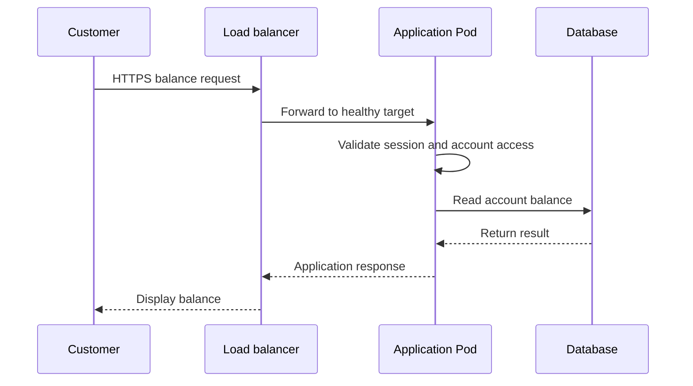

# Kubernetes in Banking: Request Flow and Pod Recovery

**Author: Shrikant Alone**  
Practical explanations, animation notes, a small Kubernetes lab, and production troubleshooting guidance.

This repository explains two questions:

1. How does a customer request travel through a banking application?
2. How can an application keep serving customers when one Pod fails?

The examples are simplified learning models. They do not describe a specific bank's production system. The lab runs a basic web server, not a banking application, and must use a learning cluster.

## Contents

- [Video 1: Customer request flow](#video-1-customer-request-flow)
- [Video 2: Pod failure and recovery](#video-2-pod-failure-and-recovery)
- [Benefits and production impact](#benefits-and-production-impact)
- [Practical lab](#practical-lab)
- [Troubleshooting](#troubleshooting)
- [Production design checklist](#production-design-checklist)
- [Interview questions](#interview-questions)
- [Official references](#official-references)

## Video files

Upload the MP4 files into a `videos` folder using these names to activate these links:

- [Customer request flow](videos/Banking_Application_Request_Flow.mp4)
- [Pod failure and recovery](videos/Kubernetes_Pod_Failure_Banking.mp4)

GitHub may show a download link instead of an inline player. These links refer to files you must add; this README does not include the videos.

## Video 1: Customer request flow

* The example

A customer opens the banking application and selects **Check Balance**. The application must identify the customer, check their access, read account data, and return a response.

* Architecture assumption

The first animation uses a load balancer with Pod IP targets. It is one possible design. A deployment with an ingress controller has an additional traffic hop. A Kubernetes Service can define backend selection without its virtual IP being traversed by external traffic when the load balancer routes directly to Pod IPs.



* Step-by-step explanation

| Step | What happens | Why it matters |
|---|---|---|
| 1. Request | The client sends an HTTPS request with the required session information. | Protects the client connection and carries the request context. |
| 2. Routing | The load balancer selects a healthy application target. | Distributes traffic across available application instances. |
| 3. Validation | The application validates identity, permissions, and request input. | A customer must only access accounts they are allowed to view. |
| 4. Database access | The application obtains a database connection and runs the query. | Retrieves the requested account information. |
| 5. Response | The application formats the result and returns it to the client. | Gives the customer the requested information or a useful error. |

HTTPS from the client does not prove that all internal connections are encrypted. Configure and verify encryption for each required connection. A load balancer health check does not replace application authentication or authorization.

* Where can a request become slow?

- Before the application: DNS, connection setup, network latency, or load balancer queues.
- Inside the application: CPU pressure, thread exhaustion, external calls, or inefficient code.
- At the database connection pool: requests waiting for a free connection.
- Inside the database: slow queries, locks, storage latency, or heavy load.
- On the return path: large payloads or network problems.

Use metrics to find a change, logs to understand errors, and traces to follow instrumented request paths. Avoid logging credentials, session tokens, account details, or personal data.

* Practical use cases

- Explain a production architecture to a new team member.
- Locate the source of slow balance enquiries.
- Separate application errors from database and network problems.
- Design dashboards around request latency and failure rates.
- Prepare for DevOps and production support interviews.

## Video 2: Pod failure and recovery

* The example

A Deployment wants three application replicas. Pod A, Pod B, and Pod C are ready. Pod B is lost, and a new Pod D is created to replace it.

The animation shows a **failed or lost Pod replacement scenario**. It does not imply that every application crash creates a new Pod.

* Recovery steps

| Stage | What happens | What customers may experience |
|---|---|---|
| 1. Normal operation | Three ready Pods handle traffic through a Service. | Requests are served normally. |
| 2. Failure | Pod B becomes unavailable. | Requests in progress may fail; stale routing can briefly affect new requests. |
| 3. Routing update | After detection and endpoint updates propagate, normal new traffic uses remaining ready Pods. | The application can continue serving if remaining capacity is sufficient. |
| 4. Replacement | The ReplicaSet creates a replacement to maintain the desired replica count. | Two existing Pods continue carrying the load. |
| 5. Startup | The new Pod is scheduled and starts its application. | The new Pod is not useful for traffic until it is ready. |
| 6. Readiness | Readiness succeeds and routing updates include the new ready endpoint. | Traffic can use all three replicas again. |

Routing changes and replacement creation can overlap. The animation's timings are illustrative. Node loss can have a different detection and recovery timeline from direct Pod deletion.

* Container restart versus Pod replacement

| Event | Typical response |
|---|---|
| An application process exits inside a Deployment Pod | The kubelet restarts the container according to restart policy, potentially with backoff. |
| A readiness check fails | The Pod becomes unready for normal Service traffic; this alone does not restart or replace it. |
| A liveness check repeatedly fails | The kubelet restarts the affected container. |
| A Deployment Pod is deleted or reaches a terminal failure | The ReplicaSet creates a replacement to maintain replicas. |
| A worker node becomes unavailable | Detection, eviction, and controller behavior affect when replacement occurs; usable capacity elsewhere is needed. |

* What the probes do

- **Startup probe:** gives a slow-starting application time to initialize before liveness and readiness probes run.
- **Readiness probe:** checks whether the application can serve traffic now.
- **Liveness probe:** detects a condition where restarting the container may help.

Do not automatically include every remote dependency in liveness checks. A shared database outage should not needlessly cause every application container to restart.

* Key lesson

**Running does not always mean ready.** Kubernetes can restore replica counts, but it cannot automatically repair broken application logic or guarantee that every customer request succeeds.

## Benefits and production impact

| Feature | Benefit | Production impact | Important limit |
|---|---|---|---|
| Multiple replicas | More than one instance can serve requests. | A single Pod failure need not stop the whole application. | Replicas need enough resources and sensible placement. |
| Readiness checks | Keep unready instances out of normal Service traffic. | Reduces traffic sent to applications that cannot serve it yet. | Detection and routing changes take time. |
| ReplicaSet reconciliation | Restores the desired replica count. | Reduces manual replacement work. | Image pulls, scheduling, and startup can delay recovery. |
| Load distribution | Spreads requests across available targets. | Helps use application capacity. | Database or downstream limits may remain. |
| Monitoring and alerts | Makes failures and slowdowns visible. | Helps teams detect and investigate incidents. | Alerts must be actionable and tied to user impact. |
| Controlled rollout | Replaces application instances gradually. | Can reduce release disruption. | Needs working probes, capacity, and compatible application changes. |

* What changes for a banking application?

In a single-instance design, losing the instance can interrupt the service until recovery. With multiple ready replicas, a single Pod loss can be handled while other replicas serve requests.

This improves resilience only when the wider system supports it:

- Remaining replicas can handle the increased load.
- The database and other required services are available.
- Session state is not available only inside the failed Pod.
- Timeouts prevent requests from waiting indefinitely.
- Retries are limited and safe. Payment writes require application-level duplicate protection, such as idempotency keys.
- Backups, restore testing, and disaster recovery cover data and regional failure scenarios.

No availability percentage, cost saving, or recovery time is promised by these examples. Measure outcomes in your own environment.

## Practical lab

* Goal and scope

Create three web-server Pods behind a ClusterIP Service. Delete one Pod and observe replacement and readiness.

This tests **controlled Pod deletion**, not a real crash or worker-node outage. The web server demonstrates routing and lifecycle behavior; it does not implement banking logic, a database, or authentication.

* Prerequisites

- A working learning cluster, such as kind or minikube.
- `kubectl` configured for that cluster.
- Permission to create a namespace, Deployment, and Service.
- Network access to pull the example image and enough cluster resources.

First check that you are using the intended learning cluster:

```bash
kubectl config current-context
kubectl get nodes
```

* 1. Create the resources

Save the following as `demo.yaml`.

The image tag is a learning example, not a claim about the latest or a production-approved release. Production images should be reviewed and pinned to an approved digest.

```yaml
apiVersion: v1
kind: Namespace
metadata:
  name: banking-demo
---
apiVersion: apps/v1
kind: Deployment
metadata:
  name: banking-web
  namespace: banking-demo
spec:
  replicas: 3
  selector:
    matchLabels:
      app: banking-web
  template:
    metadata:
      labels:
        app: banking-web
    spec:
      containers:
        - name: web
          image: nginx:stable-alpine
          ports:
            - name: http
              containerPort: 80
          resources:
            requests:
              cpu: 100m
              memory: 64Mi
            limits:
              cpu: 500m
              memory: 128Mi
          readinessProbe:
            httpGet:
              path: /
              port: http
            initialDelaySeconds: 3
            periodSeconds: 2
          livenessProbe:
            httpGet:
              path: /
              port: http
            initialDelaySeconds: 10
            periodSeconds: 10
---
apiVersion: v1
kind: Service
metadata:
  name: banking-web
  namespace: banking-demo
spec:
  selector:
    app: banking-web
  ports:
    - name: http
      port: 80
      targetPort: http
  type: ClusterIP
```

```bash
kubectl apply -f demo.yaml
kubectl rollout status deployment/banking-web -n banking-demo
kubectl get pods -n banking-demo -o wide
kubectl get endpointslices -n banking-demo \
  -l kubernetes.io/service-name=banking-web
```

Expected: three Pods eventually show `1/1` in the READY column. If they do not, investigate before continuing.

* 2. Start a request loop inside the cluster

In a separate terminal:

```bash
kubectl run request-client -n banking-demo \
  --image=busybox:1.36 --restart=Never --rm -i -- \
  sh -c 'while true; do date; wget -q -T 2 -O /dev/null http://banking-web && echo OK || echo FAILED; sleep 1; done'
```

This makes requests through the Service. A short test can miss brief failures, and a successful response does not identify which backend handled it. This is an observation exercise, not proof of zero downtime or even traffic distribution.

* 3. Watch Pod changes

In another terminal:

```bash
kubectl get pods -n banking-demo -l app=banking-web -w
```

* 4. Delete one application Pod

List the names, then replace `POD_NAME` with exactly one application Pod name:

```bash
kubectl get pods -n banking-demo -l app=banking-web
kubectl delete pod POD_NAME -n banking-demo
```

Do not delete the Deployment. It must remain present to manage the desired replicas.

* 5. Observe recovery

```bash
kubectl get replicasets -n banking-demo
kubectl get pods -n banking-demo -l app=banking-web
kubectl get endpointslices -n banking-demo \
  -l kubernetes.io/service-name=banking-web -o yaml
kubectl get events -n banking-demo --sort-by=.metadata.creationTimestamp
```

Observe the new Pod name, scheduling and startup, its READY status, and endpoint readiness conditions. Because the test uses graceful deletion, behavior can differ from an abrupt failure.

* 6. Record what you learned

| Observation | Your result |
|---|---|
| Time when deletion started | |
| Time when replacement became ready | |
| Any failed requests in the request loop | |
| Pending or image-pull delays | |
| Events that explained the behavior | |

Compare results after a second run only if you change a meaningful condition, such as available capacity or startup behavior.

* 7. Clean up

Stop the request loop with Ctrl+C. Delete only the namespace created for this exercise:

```bash
kubectl delete namespace banking-demo
```

This deletes all resources in that demo namespace.

## Troubleshooting

| Symptom | Start here | Possible causes |
|---|---|---|
| Pod stays Pending | `kubectl describe pod POD_NAME -n banking-demo` | Insufficient capacity, scheduling constraints, or storage issues. |
| ImagePullBackOff | Pod events | Incorrect image reference, registry access, or network problems. |
| Running but 0/1 Ready | Pod description and application logs | Wrong probe path or port, slow startup, or application failure. |
| CrashLoopBackOff | Current and previous container logs | Application errors, missing configuration, or repeated exits. |
| Service has no ready targets | Service selectors, Pod labels, and EndpointSlices | Selector mismatch or readiness failures. |
| Requests slow after a failure | Resource metrics and application latency | Remaining replicas overloaded or shared dependencies saturated. |

Useful commands:

```bash
kubectl describe pod POD_NAME -n banking-demo
kubectl logs POD_NAME -n banking-demo -c web --tail=100
kubectl logs POD_NAME -n banking-demo -c web --previous --tail=100
kubectl describe service banking-web -n banking-demo
kubectl get pods -n banking-demo --show-labels
kubectl top pods -n banking-demo
```

`--previous` only helps when a previous container instance exists. `kubectl top` requires a working resource metrics pipeline, usually Metrics Server.

## Production design checklist

- Set replicas based on availability and measured capacity needs.
- Spread replicas across nodes and, where appropriate, availability zones.
- Give applications time to start; tune probes against real behavior.
- Set realistic resource requests and limits.
- Design graceful shutdown and connection draining.
- Monitor request rate, errors, latency, saturation, and ready replica count.
- Configure safe timeouts and limited retries.
- Keep sensitive configuration in an appropriate secret-management system.
- Apply least-privilege permissions and required network restrictions.
- Protect databases with appropriate availability, backup, and restore designs.
- Test recovery with controlled failures in a suitable environment.
- Use a PodDisruptionBudget for supported voluntary disruptions; it does not prevent involuntary failures or guarantee uptime.

## Interview questions

**1. What is the difference between Running and Ready?**  
Running is a Pod lifecycle phase. Ready indicates whether the Pod meets readiness requirements to serve normal Service traffic.

**2. Who creates a replacement for a Deployment Pod?**  
The ReplicaSet controller maintains the requested replica count for the Deployment.

**3. Does a failed readiness check restart the container?**  
No. Readiness controls traffic eligibility. Liveness and process failures can lead to container restarts.

**4. Why might requests still fail when other Pods are healthy?**  
Requests can already be in progress, routing updates take time, or remaining Pods may lack capacity. Shared dependencies can also fail.

**5. Does adding Pods fix every performance problem?**  
No. A slow database, connection limit, or downstream bottleneck can remain or become worse.

**6. Does Kubernetes protect against duplicate payments?**  
No. Transaction correctness and duplicate protection belong in the application and data design.

## Official references

- [Kubernetes self-healing](https://kubernetes.io/docs/concepts/architecture/self-healing/)
- [Pod lifecycle](https://kubernetes.io/docs/concepts/workloads/pods/pod-lifecycle/)
- [Configure liveness, readiness and startup probes](https://kubernetes.io/docs/tasks/configure-pod-container/configure-liveness-readiness-probes/)
- [Deployments](https://kubernetes.io/docs/concepts/workloads/controllers/deployment/)
- [Services](https://kubernetes.io/docs/concepts/services-networking/service/)
- [Pod disruption budgets](https://kubernetes.io/docs/tasks/run-application/configure-pdb/)

## Keep this guide useful

When adding another video, include its scenario, architecture assumptions, steps, benefits, limits, lab commands, and official references. Review image versions and commands before rerunning the lab. Record tested cluster versions and results after actually performing the exercise.

**Validation status:** This guide and its lab are educational content. The commands have not been executed against a Kubernetes cluster as part of creating this README.
